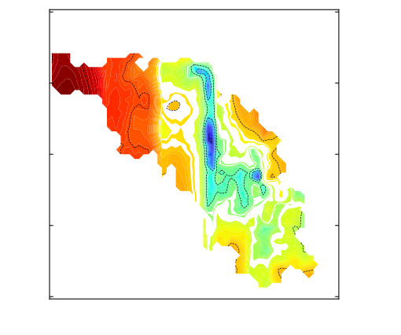
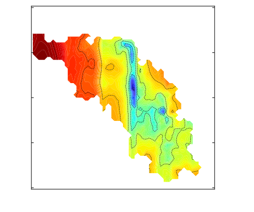

# config_center
# Obtain seed configurations near an order parameter(s) region from previous simulations
### Utility: Seed configurations for umbrella sampling
### As a SYNTHETIC example, if one has a system which has been sampled sparsely 
### (white color denotes unsampled region)
### in disconnected regions in an order parameter space

### then, this tool can be used to find new configurations to seed new simulations to sample
### the white region (unsampled region) between colored regions (sampled region)
### This can help sample the region and obtain a single connected region as shown:

## Pending update in pipeline:
### Using tarjan's algorithm for identification of disconneced regions
### and suggesting optimal centers of new umbrella sampling in an attempt
### to minimize new umbrella simulations neeed
#
# To install:
### run on shell prompt
`make`
### The output will be 
`# make test_gromacs`

`# make test_lammps`
### Choose one of the platform
### and, run one of the above
### Instructions to load environment will be outputted to use the file
### Instructions to use will be in the file with name *example*
### To locate the file:
`ls *example*`
## Running the example:
### To successfully run the example, you would need a trajectory file
### which could not be loaded to repo due to disk size limitations
### Please send request to the author, Ankur, for the trajectory file
### after which follow the instructions, i.e.
### run one of the below two, depending on the MD platform:
`source gmxexample`

`source lmpexample`
